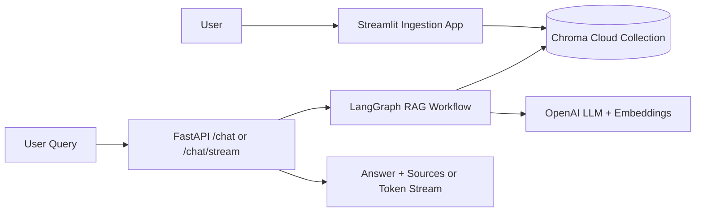
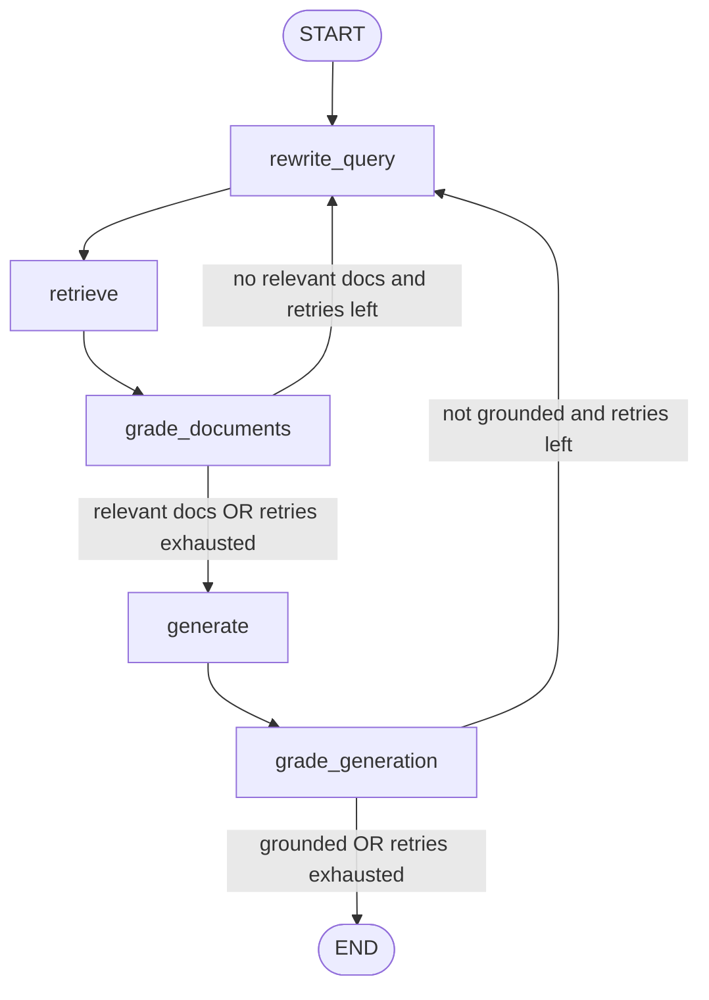
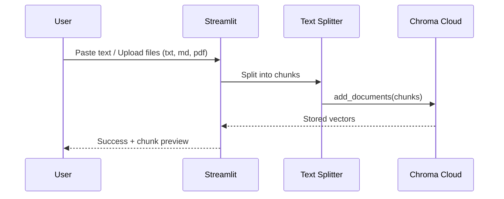

# CHROMADB DEMO

A practical Retrieval-Augmented Generation (RAG) demo built with:
- **Chroma Cloud** for vector storage
- **LangGraph** for a resilient query workflow
- **FastAPI** for chat APIs (regular + token streaming)
- **Streamlit** for document ingestion
- **OpenAI** for embeddings and answer generation

---

## What This Project Does

This project lets you:
1. Ingest text, markdown, and PDF content into a Chroma collection.
2. Ask questions over that content through a RAG pipeline.
3. Stream generated tokens in real-time using Server-Sent Events (SSE).
4. Automatically retry with query rewrites when retrieval/generation quality is low.

---

## Architecture Diagram



---

## LangGraph Workflow Diagram



---

## Project Structure

```text
.
├── api.py                 # FastAPI app with /chat and /chat/stream
├── rag_agent.py           # LangGraph RAG state machine
├── chroma_client.py       # Chroma + OpenAI client helpers
├── upload_document.py     # Streamlit ingestion UI
├── requirements.txt
├── Dockerfile
└── docker-compose.yml
```

---

## Prerequisites

- Python 3.11+ (Docker path uses Python 3.11 slim)
- Chroma Cloud account
- OpenAI API key

---

## Environment Variables

Create a `.env` file in the project root:

```env
CHROMA_API_KEY=your_chroma_api_key
CHROMA_TENANT=your_chroma_tenant
CHROMA_DATABASE=your_chroma_database
OPENAI_API_KEY=your_openai_api_key

# Optional
CHROMA_COLLECTION=edureka-session-demo
CHROMA_TOP_K=4
OPENAI_MODEL=gpt-4o-mini
OPENAI_EMBEDDINGS_MODEL=text-embedding-3-small
```

---

## Local Setup (Without Docker)

1. Create and activate a virtual environment:

```bash
python -m venv venv
source venv/bin/activate
```

2. Install dependencies:

```bash
pip install -r requirements.txt
```

3. Run FastAPI:

```bash
uvicorn api:app --host 0.0.0.0 --port 8000 --reload
```

4. Run Streamlit (new terminal):

```bash
streamlit run upload_document.py --server.address=0.0.0.0 --server.port=8501
```

---

## Docker Setup

Build and run both services:

```bash
docker compose up --build
```

Services:
- FastAPI: `http://localhost:8000`
- Streamlit: `http://localhost:8501`

---

## API Usage

### Health Check

```bash
curl http://localhost:8000/
```

### Chat (Single Response)

```bash
curl -X POST http://localhost:8000/chat \
  -H "Content-Type: application/json" \
  -d '{
    "message": "What does this project do?",
    "collection": "edureka-session-demo"
  }'
```

### Chat (Streaming SSE)

```bash
curl -N -X POST http://localhost:8000/chat/stream \
  -H "Content-Type: application/json" \
  -d '{
    "message": "Summarize the ingested docs",
    "collection": "edureka-session-demo"
  }'
```

---

## Demo Screenshots (For Presentation)

Create a folder named `screenshots/` at the project root and add:
- `streamlit-ingest.png` (upload + chunking screen)
- `api-chat-response.png` (`/chat` response in terminal/Postman)
- `streaming-output.png` (token stream from `/chat/stream`)

Then these previews will render in GitHub/Cursor markdown:

```markdown


```

### Sample `/chat` Response (Demo Ready)

```json
{
  "answer": "This project is a Chroma Cloud + LangGraph RAG demo that supports ingestion and question answering with grounding checks.",
  "sources": [
    {
      "source": "sample-doc.pdf",
      "chunk": 3,
      "id": "abc123"
    }
  ]
}
```

### Suggested Live Demo Flow (3-5 minutes)

1. Open Streamlit on `http://localhost:8501` and ingest one PDF + one text snippet.
2. Show Chroma collection name and chunking settings before clicking **Ingest into Chroma**.
3. Call `POST /chat` and explain `answer` vs `sources`.
4. Call `POST /chat/stream` and show token-by-token output.
5. Point to the LangGraph retry loop diagram and explain grounded answer checks.

---

## Ingestion Workflow



---

## Notes

- `rag_agent.py` includes retry logic (`MAX_RETRIES=2`) to improve retrieval quality and grounding.
- Sources returned by `/chat` are extracted from document metadata (`source`, `chunk`, `id`).
- CORS is open (`*`) in `api.py`, useful for demos but should be restricted in production.

---

## Future Improvements

- Add authentication and rate limiting for API endpoints.
- Add persistent tracing/observability for graph steps.
- Add tests for ingestion, routing logic, and streaming behavior.
- Add a frontend chat UI consuming `/chat/stream`.
